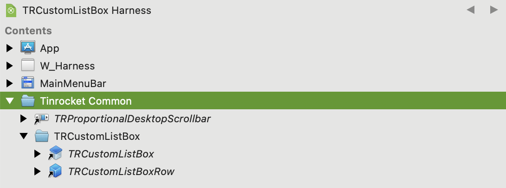

TRCustomListBox is an open-source control for Xojo that provides a flexible and user-friendly alternative to the standard listBox control. It has been developed and tested on macOS but should also work on other platforms. Currently, under development, it has a fraction of the native ListBox functionality. Full source code is available under the MIT license, so feel free to use or improve it.



**What**

TRCustomListBox offers the ability for users to easily edit text within the list without the need for multiple clicks and selections. This makes it more efficient and intuitive for end-users, particularly for applications that require frequent editing or updating of list items. While editing, the rows will grow and shrink as needed. 



**How**

The control is implemented as a Xojo ContainerControl, and the rendering is done by a Canvas. Only the visible portion of the content is drawn. This allows for a more efficient use of system resources.

The control is implemented as a Xojo ContainerControl, and the rendering is done by a Canvas. Only the visible portion of the content is drawn. This allows for a more efficient use of system resources.

The control includes a private TextArea for text metrics calculations and rendering to the canvas, improving the overall performance of the control. I weighed the use of a TextArea versus manually drawing strings with Graphics, but the TextArea offered better and more seamless results when switching between static and editing modes.

TRCustomListBox currently supports non-styled text but could easily support StyledText.

**Usage**

The main project components are stored in a folder called "Tinrocket Common" as external items. The folder can be copied into your project.

Usage is straightforward and follows naming conventions of Xojo's native ListBox and TextArea controls, where applicable. This is the code used in the demo harness to create the window shown above:

**License**

MIT
